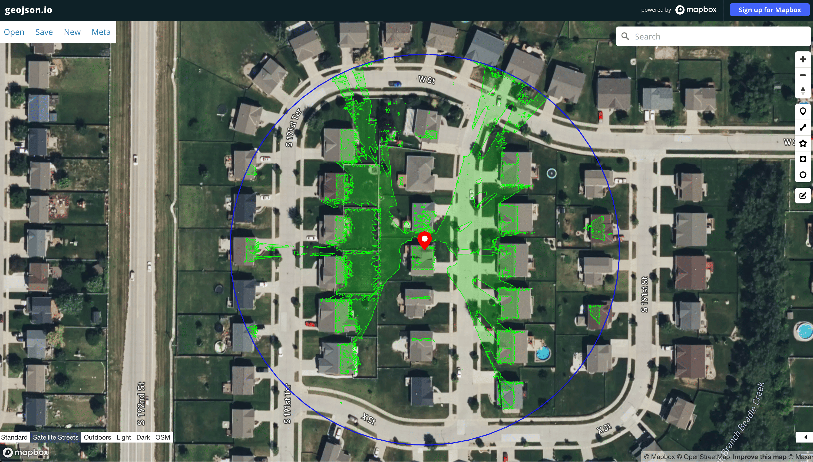
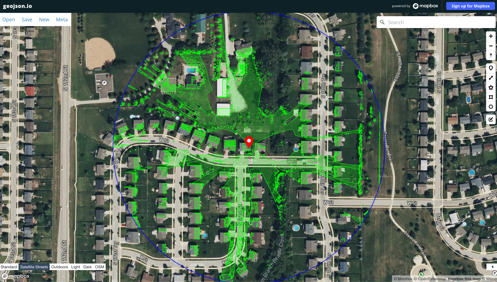

# DSM-to-Viewshed Service

A service that processes Digital Surface Models (DSM) to produce GeoJSON viewsheds from observer points, built with NestJS and Python/GDAL. Calculates terrain-based visibility areas from a given observer point.

## Architecture

The service implements a sidecar pattern - an architectural approach where the main application is augmented by a specialized helper process to handle specific tasks. This allows each component to use the best-suited technology for its role:

* **Node.js API**: Handles HTTP requests and responses
* **Python/GDAL Process**: Performs viewshed calculations using GDAL's native bindings

The Node.js app spawns Python processes on demand using `child_process.exec()`, passing DSM data and coordinates via command line arguments.

## API Endpoints

### Calculate Viewshed

`POST /viewshed`

**Request Body:**
```typescript
{
  lng: number;        // Observer longitude in WGS84
  lat: number;        // Observer latitude in WGS84
  mountHeight: number;  // Equipment height (e.g., pole, tower, etc)
  maxDistance?: number;   // Optional: Maximum analysis radius, default is 500
}
```

The mountHeight is added to whatever elevation exists at the observer point. Examples:

- Ground point:
  * Ground elevation: 100
  * mountHeight: 30 (e.g., pole, tower, etc)
  * Total height for viewshed: 130

- Rooftop point:
  * Ground + building elevation: 140
  * mountHeight: 10 (e.g., device height)
  * Total height for viewshed: 150

Note: The DSM includes terrain and building heights, so mountHeight is always added to whatever is there (ground or roof).

## Example Results

### Example 1: Short Range Analysis
```json
{
    "lat": 41.198963169072435,
    "lng": -96.21405728188392,
    "mountHeight": 5,
    "maxDistance": 300
}
```
Analysis of a rooftop device in Omaha, NE with 5-unit height and 300-unit range.


### Example 2: Extended Range Analysis
```json
{
    "lat": 41.199590197202134,
    "lng": -96.21268509010174,
    "mountHeight": 10,
    "maxDistance": 600
}
```
Same area with increased height (10 units) and doubled range (600 units) for wider coverage.


Note: Green areas indicate visible terrain from the observer point. The blue circle shows the maximum analysis range.

## Tools and Documentation

### GDAL Viewshed
This service uses GDAL's viewshed analysis. For detailed information about the algorithm and parameters, see the [GDAL Viewshed Documentation](https://gdal.org/programs/gdal_viewshed.html).

### Visualizing Results
You can visualize the GeoJSON response using [geojson.io](https://geojson.io/#map=2/0/20), a helpful tool for inspecting and validating GeoJSON data on a map.

**Unit Handling:**
The service adapts to the DSM's coordinate system:
- If DSM is in US feet: all calculations and responses use feet
- If DSM is in meters: all calculations and responses use meters

This affects elevation values, analysis radius, and coverage calculations.

**Response:** GeoJSON FeatureCollection containing:
- Visible area polygons
- Observer point with elevation metadata
- Analysis range circle

**Example Response:**
```typescript
{
  "type": "FeatureCollection",
  "features": [
    {
      "type": "Feature",
      "geometry": { "type": "Point", "coordinates": [-105.123, 40.456] },
      "properties": {
        "type": "observer",
        "elevation": 1514.5992431640625,
        "units": "feet",
        "marker-color": "#ff0000",
        "marker-size": "medium",
        "marker-symbol": "camera"
      }
    },
    {
      "type": "Feature",
      "geometry": { "type": "Polygon", "coordinates": [[...]] },
      "properties": {
        "type": "viewshed",
        "visible": true,
        "latitude": 40.457,
        "longitude": -105.124,
        "fill": "#00ff00",
        "fill-opacity": 0.2,
        "stroke": "#00ff00",
        "stroke-width": 1
      }
    },
    {
      "type": "Feature",
      "geometry": {
        "type": "LineString",
        "coordinates": [[...]]
      },
      "properties": {
        "type": "analysis_range",
        "radius": 500,
        "units": "feet",
        "stroke": "#0000ff",
        "stroke-width": 2,
        "stroke-dasharray": [5, 5],
        "stroke-opacity": 0.8
      }
    }
  ]
}
```

## Development

### DSM Files
In this implementation:
- DSM files are read from the `uploads/` directory
- File upload is not implemented in this version due to large file sizes
- To test with different DSM files:
  1. Add the file to `uploads/`
  2. Update DSM_PATH in app.service.ts

### Commands
```bash
# Start service
$ docker compose up

# Rebuild and start
$ docker compose up --build
```

Service runs at http://localhost:3000
